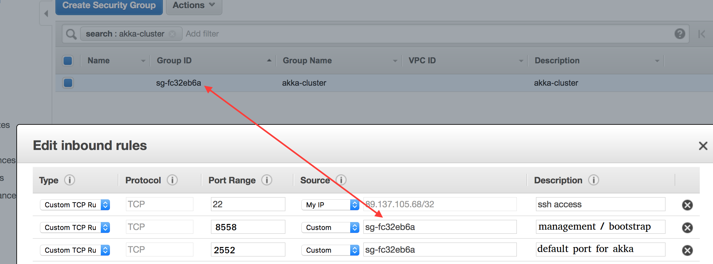

Your Akka Cluster on Vanilla EC2 using Tag Based Discovery
==========================================================

Note: these steps can be easily automated via CloudFormation or 
Python / shell scripts etc. In fact, a simple CloudFormation script is provided [here](src/main/resources/CloudFormation).  

Examine the source code
-----------------------
In `application.conf`, you'll notice the lack of need for manual configuration of IPs
or host names for the cluster to form - the discovery mechanisms will do this for us.


Step 1: Launch Instances
------------------------

From the AWS Management Console, provision a few EC2 instances (you'll need at least 2). Recommended image: Ubuntu Server 16.04. As for the instance type, this demo app runs fine even on t1.micro instances. As for the security group, 
for now, just select the default one and make sure you allow yourself ssh access to your instances. Once the instances are ready, 
ssh into them - you may need to install Java 8 ( you can use this [guide](https://www.digitalocean.com/community/tutorials/how-to-install-java-with-apt-get-on-ubuntu-16-04)).


Step 2: Create IAM Role
-----------------------

Since the `akka-discovery-aws-api` module uses the AWS HTTP API, we need to make sure that the proper security authorizations are 
in place. Hence, this step is about creating a IAM role. The IAM section is in the AWS Management Console, under "Services" and 
under "Security, Identity & Compliance". Click "Create role" and select "AWS service" (for type of trusted entity) and EC2 
(for the service that will use this role). Attach the "AmazonEC2ReadOnlyAccess" permission to this role. 
This permission should be sufficient for the `akka-discovery-aws-api` module to do its job.


Step 3: Attach IAM Role
-----------------------

Go back to the EC2 view of the AWS Management Console and attach the newly created role to each and every EC2 instance you
launched in Step 1. See screenshot below to see how to do this.


Step 4: Create Security Group
-----------------------------

Since we want to run an an Akka cluster on these instances, they have to be able to talk to each other: the TCP ports we 
care about are 2552 and 8558. However, we don't want to open these ports to the whole wide world. In the Amazon Cloud,
instances can *privately* communicate with each other if they are part of the same security group *and* if the proper inbound 
rules are set. 

Create a security group called "akka-cluster". Once the security group is created, select it and go to "edit inbound rules". 
First, add a custom TCP rule to allow yourself ssh access (port: 22, source: My IP). Then, add two custom TCP rules (for ports 8558, 2552)
using a custom source: the ID of the security group. 

See the screenshot below.



Step 5: Attach Security Group
-----------------------------

Assign the 'akka-cluster' security group to your EC2 instances.

Step 6: Package the App
-----------------------

Compile and package the demo app.

```
$ cd akka-management 
$ sbt
> project bootstrap-joining-demo-aws-api-ec2-tag-based
> universal:packageBin
```

Now, in the `bootstrap-joining-demo/aws-api-ec2/target/universal` folder, you should have a
`app.zip` file. 

Step 7: Tag Instances
---------------------

Tag your instances with tag "service" -> "products-api". 
The demo app is configured (via the "akka.discovery.aws-api-ec2-tag-based.filters" key, see the application.conf file) 
to require an additional tag "purpose" -> "demo". 


Step 8: Run and validate the cluster !
--------------------------------------

Transfer (via scp, for example) the package zip file to your EC2 instances. 
Unzip the package and run the app like this on each instance:

```
$ unzip app.zip
$ cd app/bin
$ MY_IP=`curl -s http://169.254.169.254/latest/meta-data/local-ipv4`
$ ./akka-management-bootstrap-joining-demo-aws-api-ec2-tag-based -Dakka.management.http.hostname=$MY_IP -Dakka.remote.netty.tcp.hostname=$MY_IP
```

Follow the logs and watch for signs of successful cluster formation (e.g., a welcome message from one of the nodes). 

Open a second terminal session to one of the EC2 instances:

```
$ MY_IP=`curl -s http://169.254.169.254/latest/meta-data/local-ipv4`
$ curl -XGET http://$MY_IP:8558/cluster/members | python -mjson.tool
```

You should see two members with status equal to 'Up' and no unreachable members.

Congrats.
