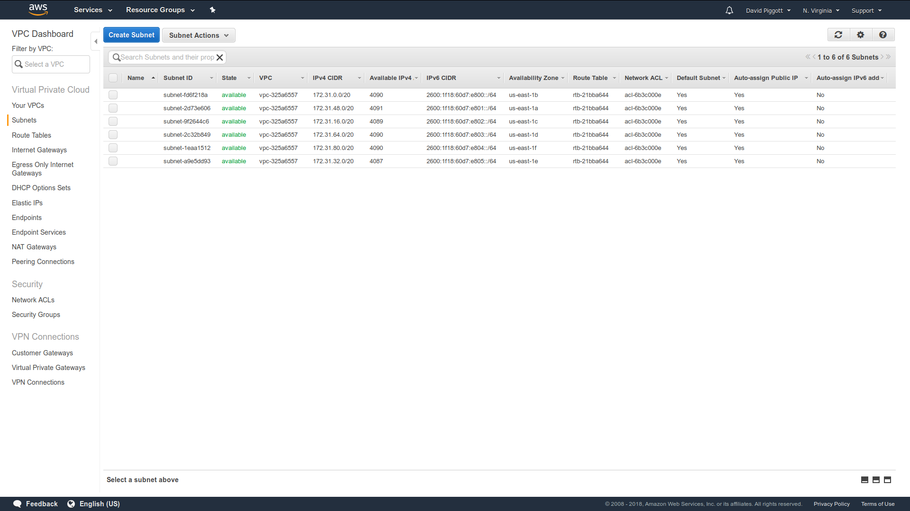
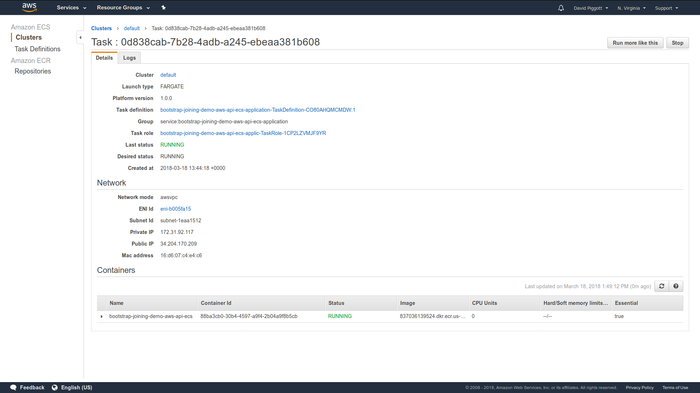
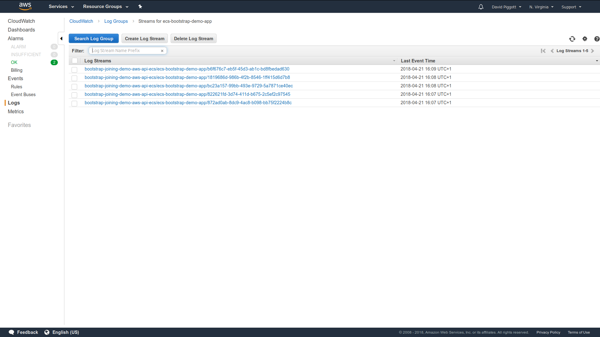
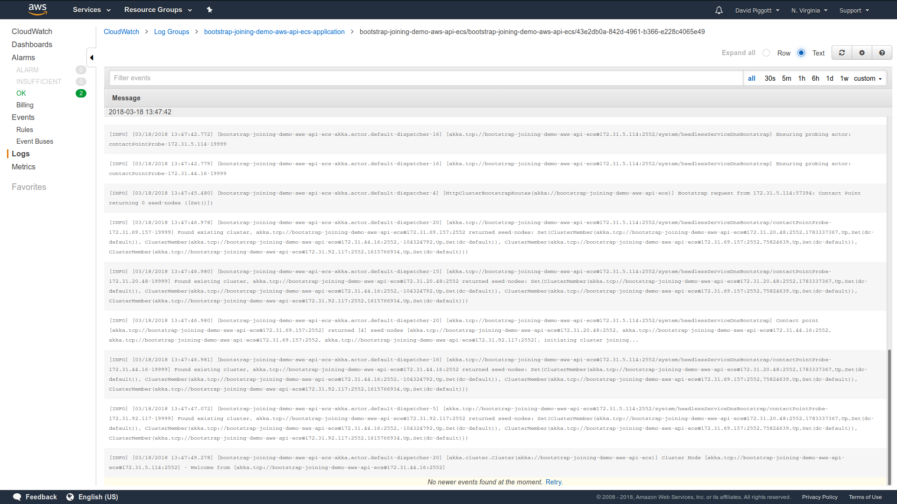
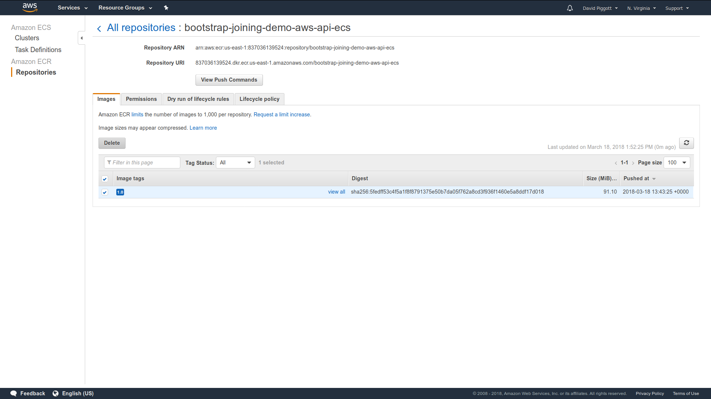
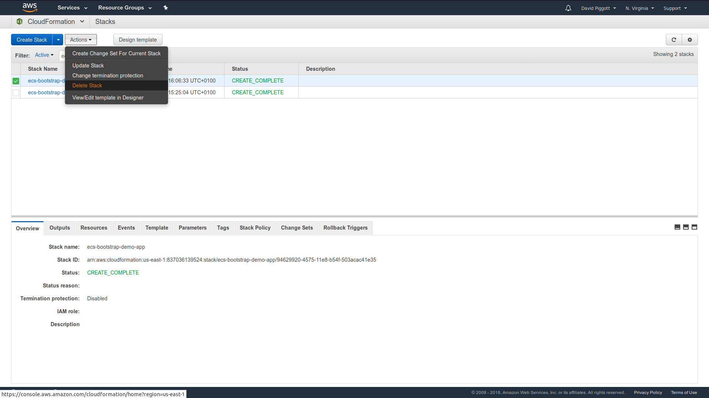

# Your Akka Cluster on ECS

**Note:**

The ECS Service Discovery module and this demo are both written solely
for use with awsvpc mode networking. Use with bridge mode or host mode
networking is _not_ supported.

**Note:**

The provided CloudFormation application stack configures the task definition
and service for use with [Fargate](https://aws.amazon.com/fargate/). This is
done in the interest of simplicity (it removes the need for the stack to also
create a container instance). At the time of writing, Fargate is only available
in the us-east-1 region. This is why the CloudFormation stacks and scripts have
the region set to us-east-1.

However, the ECS Service Discovery is _not_ limited to use with Fargate. By
removing the two Fargate configuration lines and adding a container-instance
resource you can also run it with "classic" bring-your-own-container-instance
ECS (and thus in any region).

**Note:**

You'll need to have [SBT](https://www.scala-sbt.org/),
[Docker](https://www.docker.com), and the [AWS CLI](https://aws.amazon.com/cli/)
installed and configured.


# Step 1: Examine the source code

Examine the source code. See how simple it is. There is no hard coding
of seed node IPs or host names in the application config.


# Step 2: Create the ECR repository

You can do this manually via the web console by creating an ECR repo called
`bootstrap-joining-demo-aws-api-ecs`, _or_ by running the included
CloudFormation wrapper script:

`./scripts/create-infrastucture.sh`


# Step 3: Build and publish the Docker image

The easiest way to do this is by running the included script (which you read
earlier, right?):

`./scripts/publish-application.sh`

The script uses `docker:publishLocal` and then tags and pushes the image
manually (in favour of just using `docker:publish` as might normally be done)
because this avoids the need to set `dockerRepository` within the SBT build
(which would then require that we inject the AWS account ID into the build).


# Step 4: Identify your subnet IDs

The application stack configures the demo ECS service to launch with five task.
instances.

Before you can create the cluster itself, you need to identify which subnets
you want the task instances to be launched in.

Go to the VPC service area of the AWS Management Console, then go to the
Subnets tab. You can compare with the screenshot below as a guide to what
you're looking for.



For the purposes of the demo we'll assume you're using your default VPC (the
one AWS creates for you automatically), though this need not be the case.

Make a note of the IDs of the subnets that your VPC has. You'll need them in
the following format for CloudFormation:

`subnet-fd6f218a,subnet-2d73e606,subnet-9f2644c6,subnet-2c32b849,subnet-1eaa1512,subnet-a9e5dd93`

(don't use this literal value!)


# Step 5: Create and validate the cluster

## Create the cluster

Again, the included wrapper script can be used for this (ultimately it
just delegates to `aws cloudformation create-stack`):

`./scripts/create-application.sh $subnetsIdentifiedInStepFour`


## Watch it form

The security group that the stack defines and associates with the task
definition includes a rule to allow public access to port 19999 so that the
formation of the cluster can be observed as follows:

`watch -n 1 -c "curl http://$taskInstanceIp:19999/cluster/members/ | python
-mjson.tool"`

`$taskInstanceIp` should be replaced with the public IP of any of the five task
instances. You can find these by going to the Elastic Container Service area
of the AWS Management Console, opening the default cluster, selecting the Tasks
tab, and then clicking any one of the five tasks. You can compare with the
screenshot below as a guide to what you're looking for.



When the cluster has fully formed you should see output like this:

```
{
    "leader": "akka.tcp://bootstrap-joining-demo-aws-api-ecs@172.31.20.48:2552",
    "members": [
        {
            "node": "akka.tcp://bootstrap-joining-demo-aws-api-ecs@172.31.69.157:2552",
            "nodeUid": "75824639",
            "roles": [
                "dc-default"
            ],
            "status": "Up"
        },
        {
            "node": "akka.tcp://bootstrap-joining-demo-aws-api-ecs@172.31.92.117:2552",
            "nodeUid": "1615766934",
            "roles": [
                "dc-default"
            ],
            "status": "Up"
        },
        {
            "node": "akka.tcp://bootstrap-joining-demo-aws-api-ecs@172.31.5.114:2552",
            "nodeUid": "1027838693",
            "roles": [
                "dc-default"
            ],
            "status": "Up"
        },
        {
            "node": "akka.tcp://bootstrap-joining-demo-aws-api-ecs@172.31.44.16:2552",
            "nodeUid": "-104324792",
            "roles": [
                "dc-default"
            ],
            "status": "Up"
        },
        {
            "node": "akka.tcp://bootstrap-joining-demo-aws-api-ecs@172.31.20.48:2552",
            "nodeUid": "1783337367",
            "roles": [
                "dc-default"
            ],
            "status": "Up"
        }
    ],
    "oldest": "akka.tcp://bootstrap-joining-demo-aws-api-ecs@172.31.20.48:2552",
    "selfNode": "akka.tcp://bootstrap-joining-demo-aws-api-ecs@172.31.92.117:2552",
    "unreachable": []
}
```

Nicely done!

You can also observe the log output from akka-cluster-bootstrap and
akka-cluster by navigating to the CloudWatch area of the AWS Management
Console, opening the Logs tab, and selecting the demo Log Group:





Click any of the five log streams to view the logs of the associated task
instance:




# Step 6: Cleanup

With one exception, deletion of all the resources created by the demo can be
achieved by telling CloudFormation to delete the two stacks.

The exception is that CloudFormation will not delete the ECR repository unless
it's empty, so first go and delete the image in ECR:



You can now delete the two stacks:



You'll probably also want to delete the Docker images from your local registry:

1. `docker rmi 837036139524.dkr.ecr.us-east-1.amazonaws.com/bootstrap-joining-demo-aws-api-ecs:1.0`
2. `docker rmi bootstrap-joining-demo-aws-api-ecs`