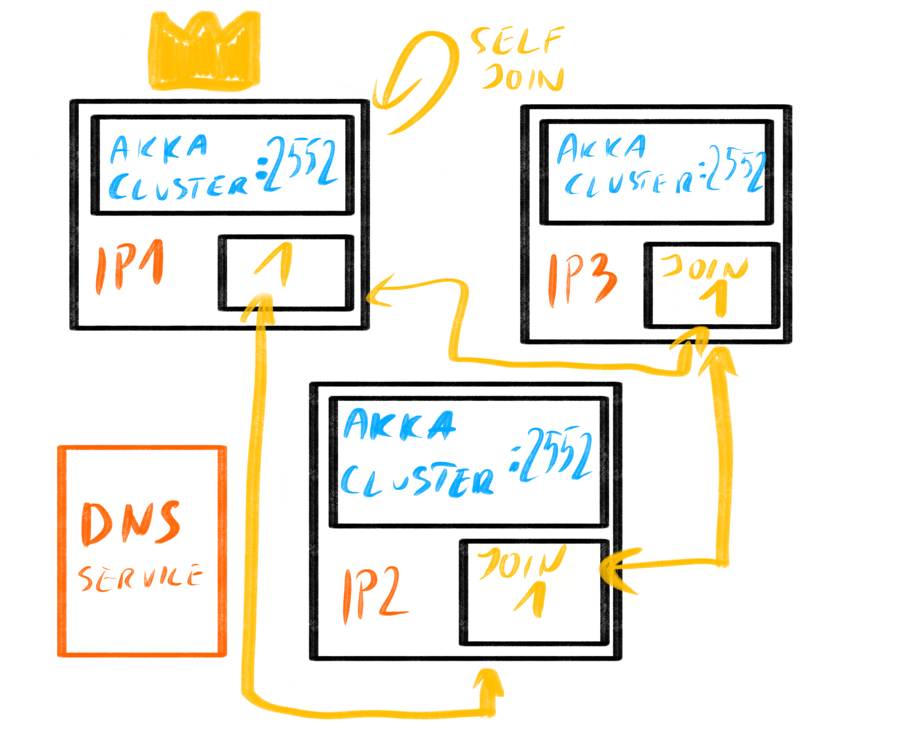

# Bootstrap details

The Akka Cluster Bootstrap process is composed of two phases:

* Contact point discovery
* Contact probing

## Contact point discovery

First, a minimum number of Contact Points need to be gathered. 
Contact pojints are discovered by `akka.management.cluster.bootstrap.contact-point-discovery.service-name` appended
with `akka.management.cluster.bootstrap.contact-point-discovery.service-namespace` , this will be passed to the configured
service discovery mechanism.

Note that at this point the node has not joined any cluster yet.

## Contact probing.

The Contact Points are contacted using HTTP which does not need Cluster membership.

In this moment, we have multiple nodes probing each other's Contact Points. And if a contact point responds with
a known set of seed nodes, the probing node will join those. This can be seen as "epidemic" joining. Since that node will,
once it has completed joining, also start advertising those seed nodes using its own Contact Point, so any other node that
has not yet joined, but is probing this node, would get this information and join the existing cluster.

In the case no cluster exists yet -- the initial bootstrap of a cluster -- nodes will keep probing one another for a while
(`akka.management.cluster.bootstrap.contact-point-discovery.stable-margin`) and once that time margin passes, they will decide that
no cluster exists, and one of the seen nodes should join *itself* to become the first node of a new cluster. It is of utmost
importance that only one node joins itself, so this decision has to be made deterministically. Since we know the addresses
of all Contact Points, and the contact points relate 1:1 to a Akka Remoting (Akka Cluster) address of the given node,
we're able to use this information to make a deterministic decision, without coordination across these nodes, as to which
of them should perform this join. We make this decision by sorting the known addresses from lowest to highest, and the
*lowest* address joins itself. It will then start advertising itself as seed node in it's Contact Point, which other nodes
will notice and start joining this node. Now the process just explained in the previous paragraph, referred to as "epidemic 
joining" continues until all nodes have joined the cluster. 

### More details

The bootstrap process can be roughly explained in two situations, one being when no cluster exists in the deployment
at all yet (which we call the "initial bootstrap) and the other case being when a cluster already exists and we're 
simply adding new nodes to it wanting them to discover and join that cluster.

#### Case 1: "Initial" Bootstrap process

- New node is started, we call it "X".
- The node discovers its "neighbours" using akka-discovery (e.g. using DNS).
    - This is NOT enough to safely join or form a cluster, some initial negotiation between the nodes must take place.
- The node starts to probe the Contact Points of the discovered nodes (which are HTTP endpoints, exposed via
  Akka Management by the Bootstrap Management Extension) for known seeds to join.
- Since no cluster exists yet, none of the contacted nodes return any seed nodes during the probing process.
    - The `stable-margin` timeout passes, and no discovery changes are observed as well.
    - At least `akka.management.cluster.bootstrap.contact-point-discovery.required-contact-point-nr` nodes have been discovered.
    - Communication with all discovered Contact Points have been confirmed via successful HTTP request-response.
    - The nodes all decide (autonomously) that no cluster exists, and a new one should be formed,
      they know all their addresses, and decide that the "lowest" sorted address is to start forming the cluster.
    - The lowest address node (e.g. "A") notices the same, and makes the decision to *join itself*.
    - Once the lowest addressed node has joined itself, it has formed a new cluster.
    - Other nodes, including X, will notice that A has started returning *itself* as a seed-node in the Contact Point responses.
    - Any node, including X, immediately joins such seed node that it has observed in the Contact Point process.
    - Nodes continue probing the other nodes, and eventually will notice any of the existing nodes that are part of the cluster,
      and immediately join it. This phase is referred to as "epidemic joining".
    - Eventually all nodes have joined the same cluster, the process is complete.

The illustration below may be of help in visualising this process:



Additionally, a setting is provided, `akka.management.cluster.bootstrap.form-new-cluster` that can be disabled to only allow the
node to join existing clusters (Case 2 below). This can be used to provide additional safety during the typical deployment
as it is relatively rare that no cluster exists. It can be specified in your `application.conf` or provided as an
argument to the process itself via `-Dakka.management.cluster.bootstrap.form-new-cluster=<true|false>`. By default, it is enabled.

The reason to not use Akka's remoting in the contact point probing itself is to in the future enable upgrades semi-automatic between even not wire compatible binary versions or protocols (e.g. moving from a classic remoting based system to an Artery based one), or even more advanced deployment patterns.

#### Case 2: Bootstrap process, with existing cluster

The Bootstrap process in face of an existing cluster in a deployment is very simple, and actually if you read through
Case 1, you already seen it in action.

- New node is started, we call it "X".
- The node discovers its "neighbours" using akka-discovery (e.g. using DNS).
    - This is NOT enough to safely join or form a cluster, some initial negotiation between the nodes must take place.
- The node starts to probe the Contact Points of the discovered nodes (which are HTTP endpoints, exposed via
  Akka Management by the Bootstrap Management Extension) for known seeds to join.
- A cluster exists already, and when probing the various nodes node X will receive at least one seed-node address, from the contact points.
    - The node joins any discovered (via Contact Points probing) seed-node and immediately becomes part of the cluster.
    - The process is complete, the node has successfully joined the "right" cluster.
        - Notice that this phase is exactly the same as the "epidemic joining" in the more complicated Case 1 when a new
          cluster has to be formed.

Illustration of this case:


### Specific edge-cases explained

It is important to realise no *dynamic and automatic* cluster joining solution provides 100% safety, however the process
presented here is very close to it. Please note that the often used claim of using a consistent data store for the 
seed-nodes also is not 100% safe (sic!), since races could occur between the node having discovered a node from the strongly 
consistent store and attempting the join operation.

The here proposed solution is prone to very few and rather rare races. Built-in protection against the race cases exists
in the form of the stable timeout, which means that if any changes are being observed in discovery, the decision making
is delayed until the observation is stable again. This prevents initiating joining while discovery is still inconsistent.

Note also that the bootstrap process does NOT rely on full consistency of the discovery mechanism when adding new nodes 
to an existing cluster. This is very desirable, since this situation usually occurs when dynamically scaling up due to 
increased load on your service, and some services may indeed not be fully consistent then. However, the Akka Cluster 
membership protocol IS strongly consistent, and it is the source of truth with regards what the cluster is consisting of,
and no external system can have more reliable information about this (since it could be outdated). This is why the 
Contact Point probing mechanism exists, and even if discovery would only return *partial* or even *different set of nodes
for each lookup* the probing would allow the node still to join all the right nodes, thanks to how Akka Cluster's membership
and gossip protocols work. Summing up, the bootstrap mechanism works well for adding nodes to the system, even under load,
even if the DNS system is not completely consistent. 

If however we are talking about an inconsistent DNS lookup response during the Initial Bootstrap, the nodes will be delayed
forming the cluster as they expect the lookups to be consistent, this is checked by the stable-margin configuration option.

For complete safety of the Initial Bootstrap it is recommended to set the `akka.management.cluster.bootstrap.contact-point-discovery.required-contact-point-nr`
setting to the exact number of nodes the initial startup of the cluster will be done. For example, if starting a cluster with
4 nodes initially, and later scaling it out to many more nodes, be sure to set this setting to `4` for additional safety of
the initial joining, even in face of an flaky discovery mechanism!

@@@ note
  It *is* crucial for the nodes to have a consistent view of their neighbours for the Initial Bootstrap.
@@@


## Recommended Configuration

When using the bootstrap module, there are some underlying Akka Cluster settings that should be specified to ensure
that your deployment is robust.

Since the target environments for this module are dynamic, that is, instances can come and go, failure needs to be
considered. The following configuration will result in your application being shut down after 40 seconds if it is unable to
join the discovered seed nodes. In this case, the orchestrator (i.e. Kubernetes or Marathon) will restart your node
and the operation will (presumably) eventually succeed. You'll want to specify the following in your `application.conf` file:

```hocon
akka.cluster.shutdown-after-unsuccessful-join-seed-nodes = 40s
```

Additionally, nodes can crash causing cluster members to become unreachable. This is a tricky problem as it is not
possible to distinguish between a network partition and a node failure. To rectify this in an automated manner,
Lightbend provides [Split Brain Resolver](https://developer.lightbend.com/docs/akka-commercial-addons/current/split-brain-resolver.html)
as a feature of the Lightbend Subscription. This module has a number of strategies that can ensure that the cluster
continues to function during network partitions and node failures.

## Customising join behavior

The above section explains the default `JoinDecider` implementation. It is possible to replace the implementation with
configuration property `akka.management.cluster.bootstrap.join-decider.class`. See `reference.conf` and API
documentation.

