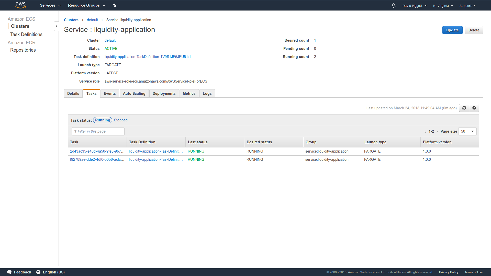

## AWS API

@@@ warning

This module is community maintained and the Lightbend subscription doesn't cover support for this module.
  It is also marked as @extref:[may change](akka:common/may-change.html).
  That means that the API, configuration or semantics can change without warning or deprecation period.

@@@

If you're using EC2 directly _or_ you're using ECS with host mode networking
_and_ you're deploying one container per cluster member, continue to
@ref:[Discovery Method: AWS API - EC2 Tag-Based Discovery](aws.md#discovery-method-aws-api-ec2-tag-based-discovery).

If you're using ECS with
[awsvpcs](https://aws.amazon.com/blogs/compute/introducing-cloud-native-networking-for-ecs-containers/)
mode networking (whether on EC2 or with
[Fargate](https://aws.amazon.com/fargate/)), continue to
@ref:[Discovery Method: AWS API - ECS Discovery](aws.md#discovery-method-aws-api-ecs-discovery).

ECS with bridge mode networking is not supported.

If you're using EKS, then you may want to use the
@ref:['Kubernetes API'-based discovery method](kubernetes.md)
instead.


## Project Info

@@project-info{ projectId="akka-discovery-aws-api" }

### Discovery Method: AWS API - EC2 Tag-Based Discovery

You can use tags to simply mark the instances that belong to the same cluster. Use a tag that
has "service" as the key and set the value equal to the name of your service (same value as `akka.management.cluster.bootstrap.contact-point-discovery.service-name`
defined in `application.conf`, if you're using this module for bootstrapping your Akka cluster).

Screenshot of two tagged EC2 instances:


Note the tag **service** -> *products-api*. It is set on both instances.

Note that this implementation is adequate for users running service clusters on *vanilla* EC2 instances. These
instances can be created and tagged manually, or created via an auto-scaling group (ASG). If they are created via an ASG,
they can be tagged automatically on creation. Simply add the tag to the auto-scaling group configuration and
ensure the "Tag New Instances" option is checked.


#### Dependencies and usage (EC2 Tag-Based Discovery)

This is a separate JAR file:

@@dependency[sbt,Gradle,Maven] {
  group="com.lightbend.akka.discovery"
  artifact="akka-discovery-aws-api_2.12"
  version="$project.version$"
}

And in your `application.conf`:

```
akka.discovery {
  method = aws-api-ec2-tag-based
}
```

Notes:

* You will need to make sure that the proper privileges are in place for the discovery implementation to access
the Amazon EC2 API. The simplest way to do this is by creating a IAM role that, at a minimum, allows the _DescribeInstances_ action.
Attach this IAM role to the EC2 instances that need to access the discovery implementation. See the docs for
[IAM Roles for Amazon EC2](https://docs.aws.amazon.com/AWSEC2/latest/UserGuide/iam-roles-for-amazon-ec2.html).


* In general, for the EC2 instances to "talk to each other" (necessary for forming a cluster), they need to be in the
same security group and [the proper rules have to be set](https://docs.aws.amazon.com/AWSEC2/latest/UserGuide/security-group-rules-reference.html#sg-rules-other-instances).

* You can set additional filters (by instance type, region, other tags etc.) in your application.conf file, in the
`akka.discovery.aws-api-ec2-tag-based.filters` key. The filters have to be key=value pairs separated by the semicolon
character. For example:
    ```
    akka {
      discovery {
        aws-api-ec2-tag-based {
          filters = "instance-type=m1.small;tag:purpose=production"
        }
      }
    }
    ```

* By default, this module is configured for clusters with one Akka node per EC2 instance: it
  separates cluster members solely by their EC2 IP address. However, we can change the default configuration to indicate multiple ports per discovered EC2 IP, and achieve
a setup with multiple Akka nodes (i.e. multiple JVMs) per EC2 instance.
    ```
    akka {
      discovery {
        aws-api-ec2-tag-based {
          ports = [8557, 8558, 8559] # 3 Akka nodes per EC2 instance
          # note that the above need to be the ports associated with the *Akka Management* extension
        }
      }
    }
    ```
    Note: this comes with the limitation that each EC2 instance has to have the same number of Akka nodes.

* You can change the default tag key from "service" to something else. This can be done via `application.conf`, by
setting `akka.discovery.aws-api-ec2-tag-based.tag-key` to something else.
    ```
    akka.discovery.aws-api-ec2-tag-based.tag-key = "akka-cluster"
    ```

* If your service is running in a docker container, you will need to configure Akka Management with separate
  IPs for binding and discovery. This is because Akka Management needs to _bind_ to the internal docker IP,
  but will _discover_ the "host" IP (the EC2 private IP) on the AWS API. See @ref:[Basic
  Configuration](../akka-management.md) on how to separate the bind IP from the discovery IP.

Demo:

* A working demo app is available in the [integration-test](https://github.com/akka/akka-management/tree/master/integration-test/aws-api-ec2)
folder.


### Discovery Method: AWS API - ECS Discovery

If you're using ECS with
[awsvpc](https://aws.amazon.com/blogs/compute/introducing-cloud-native-networking-for-ecs-containers/)
mode networking, you can have all task instances of a given ECS service discover
each other. If you're using this module for bootstrapping your Akka cluster that
you'll do so by setting the value of
`akka.management.cluster.bootstrap.contact-point-discovery.service-name` to that of the
ECS service itself.

Screenshot of two ECS task instances (the service name is
`liquidity-application`):




#### Dependencies and usage (ECS Discovery)

There are two "flavours" of the ECS Discovery module. Functionally they are
identical; the difference is in which version of the AWS SDK they use. They are
both provided so that you can choose which set of AWS SDK dependencies you're
most comfortable with bringing in to your project.

##### akka-discovery-aws-api

This uses the mainstream AWS SDK. The advantage here is that if you've already
got the mainstream AWS SDK as a dependency you're not now also bringing in the
preview SDK. The disadvantage is that the mainstream SDK does blocking IO.

@@dependency[sbt,Gradle,Maven] {
  group="com.lightbend.akka.discovery"
  artifact="akka-discovery-aws-api_2.12"
  version="$project.version$"
}

And in your `application.conf`:

```
akka.discovery {
  method = aws-api-ecs
  aws-api-ecs {
    # Defaults to "default" to match the AWS default cluster name if not overridden
    cluster = "your-ecs-cluster-name"
  }
}
```


##### akka-discovery-aws-api-async

This uses the preview AWS SDK. The advantage here is that the SDK does
non-blocking IO, which you probably want. You might need to think carefully
before using this though if you've already got the mainstream AWS SDK as a
dependency.

Once the async AWS SDK is out of preview it is likely that the
`akka-discovery-aws-api` module will be discontinued in favour of
`akka-discovery-aws-api-async`.

@@dependency[sbt,Gradle,Maven] {
  group="com.lightbend.akka.discovery"
  artifact="akka-discovery-aws-api-async_2.12"
  version="$project.version$"
}

And in your `application.conf`:

```
akka.discovery {
  method = aws-api-ecs-async
  aws-api-ecs-async {
    # Defaults to "default" to match the AWS default cluster name if not overridden
    cluster = "your-ecs-cluster-name"
  }
}
```


Notes:

* Since the implementation uses the AWS ECS API, you'll need to make sure that
  AWS credentials are provided. The simplest way to do this is to create an IAM
  role that includes appropriate permissions for AWS ECS API access. Attach
  this IAM role to the task definition of the ECS Service. See the docs for
  [IAM Roles for Tasks](https://docs.aws.amazon.com/AmazonECS/latest/developerguide/task-iam-roles.html).

* In general, for the ECS task instances to "talk to each other" (necessary for
  forming a cluster), they need to be in the same security group and the proper
  rules have to be set. See the docs for
  [Task Networking with the `awsvpc` Network Mode](https://docs.aws.amazon.com/AmazonECS/latest/developerguide/task-networking.html).

* akka-remote by default sets `akka.remote.netty.tcp.hostname` to the result of
  `InetAddress.getLocalHost.getHostAddress`, and akka-management does the same
  for `akka.management.http.hostname`. However,
  `InetAddress.getLocalHost.getHostAddress` throws an exception when running in
  awsvpc mode (because the container name cannot be resolved), so you will need
  to set this explicitly. An alternative host address discovery method is
  provided by both modules. The methods are
  `EcsSimpleServiceDiscovery.getContainerAddress` and
  `AsyncEcsSimpleServiceDiscovery.getContainerAddress` respectively, which you
  should use to programmatically set both config hostnames.

* Because ECS service discovery is only able to discover IP addresses (not ports
  too) you'll need to set
  `akka.management.cluster.bootstrap.contact-point.fallback-port = 8558`, where
  8558 is whatever port you choose to bind akka-management to.

* The current implementation only supports discovery of service task instances
  within the same region.

Demo:

* A working demo app is available in the
  [integration-test](https://github.com/akka/akka-management/tree/master/integration-test/aws-api-ecs)
  folder. It includes CloudFormation templates with minimal permissions w.r.t to
  IAM policies and security group ingress, and so is a good starting point for
  any deployment that integrates the
  [principle of least privilege](https://en.wikipedia.org/wiki/Principle_of_least_privilege).


