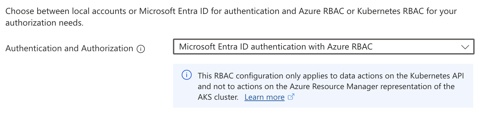

## Azure API

## Project Info

@@project-info{ projectId="akka-discovery-azure-api" }

### Discovery Method: AKS Azure RBAC Based Discovery

You can use `azure-rbac-aks-api` based discovery with azure rbac and workload identity enabled AKS clusters.

The Akka dependencies are available from Akka's library repository. To access them there, you need to configure the URL
for this repository.

@@@note
The Akka dependencies are available from Akka’s secure library repository. To access them you need to use a secure, tokenized URL as specified at https://account.akka.io/token.
@@@

Additionally, add the dependency as below.

@@dependency[sbt,Gradle,Maven] {
symbol1=AkkaManagementVersion
value1=$project.version$
group="com.lightbend.akka.discovery"
artifact="akka-discovery-azure-api_$scala.binary.version$"
version=AkkaManagementVersion
}

### Getting started

`akka-discovery-azure-api` is similar to the `akka-discovery-kubernetes-api` in that it queries the AKS Kubernetes
API server to find pods with a given label but different in terms how authentication and authorization work. The
discovery method doesn't require using the more traditional Kubernetes RBAC but instead relies on using Azure RBAC.

* `Authentication and Authorization` is set to `Microsoft Entra ID authentication with Azure RBAC`



* Workload Identity is enabled for the AKS cluster

@@@ note

This step will deploy azure workload identity controller to your aks cluster in the kube-system namespace

@@@

```shell
az aks update --resource-group "${RESOURCE_GROUP}" \
  --name "${CLUSTER_NAME}" --enable-oidc-issuer \
  --enable-workload-identity
```

* Create a Microsoft Azure Manged Identity

```shell
az identity create --name "${USER_ASSIGNED_IDENTITY_NAME}" \
  --resource-group "${RESOURCE_GROUP}" --location "${LOCATION}" \
  --subscription "${SUBSCRIPTION}"
```

* Assign `AKS Pod Reader` to the Managed Identity

* Create Federated Credential for the Managed Identity

```shell
az identity federated-credential create \
  --name ${FEDERATED_IDENTITY_CREDENTIAL_NAME} \
  --identity-name "${USER_ASSIGNED_IDENTITY_NAME}" \
  --resource-group "${RESOURCE_GROUP}" --issuer "${AKS_OIDC_ISSUER}" \
  --subject system:serviceaccount:"${SERVICE_ACCOUNT_NAMESPACE}":"${SERVICE_ACCOUNT_NAME}" \
  --audience api://AzureADTokenExchange
```

* Create a Kubernetes Service Account

```shell
kubectl apply -f - <<EOF
apiVersion: v1
kind: ServiceAccount
metadata:
  name: <akka-app>
  namespace: <akka-app-namespace>
  annotations:
    azure.workload.identity/client-id: "XXXXXXXXXXXXXXXXX"
EOF
```

* Label Pods with `azure.workload.identity/use: "true"`

```shell
kubectl apply -f - <<EOF
apiVersion: apps/v1
kind: Deployment
metadata:
  name: <akka-app>
  namespace: <akka-app-namespace>
# Removed for brevity
spec:
  template:
    metadata:
      labels:
        azure.workload.identity/use: "true"
     spec:
      serviceAccountName: <akka-app>
      # Removed for brevity
```

* Change `application.conf` to use the discovery method:

```hocon
akka {
  # Removed for brevity
  management {
    cluster.bootstrap {
      contact-point-discovery {
        discovery-method = azure-rbac-aks-api
        azure-rbac-aks-api {
          pod-namespace = "test-akka-app"
        }
      }
    }
  }
}
```

Azure's workload identity controller will inject your application pods with environment variables that the discovery
method uses to query the AKS Kubernetes Cluster's API Server. Here's a list of environment variables that get injected
in pods:

```shell
${AZURE_AUTHORITY_HOST}
${AZURE_AUTHORITY_HOST}
${AZURE_AUTHORITY_HOST}
${AZURE_AUTHORITY_HOST}
```

Additionally, the discovery method uses the `AZURE_SERVER_ID` environment variable whose default value is set to
`6dae42f8-4368-4678-94ff-3960e28e3630/.default`. This is the application used by the server side. The access token
accessing AKS clusters need to be issued for this app.

@@@ note

AKS uses a pair of first-party Microsoft Entra applications.

These application IDs are the same in all environments. The AKS Microsoft Entra server application ID that the server
side uses is 6dae42f8-4368-4678-94ff-3960e28e3630. The access token that accesses AKS clusters must be issued for this
application.

@@@