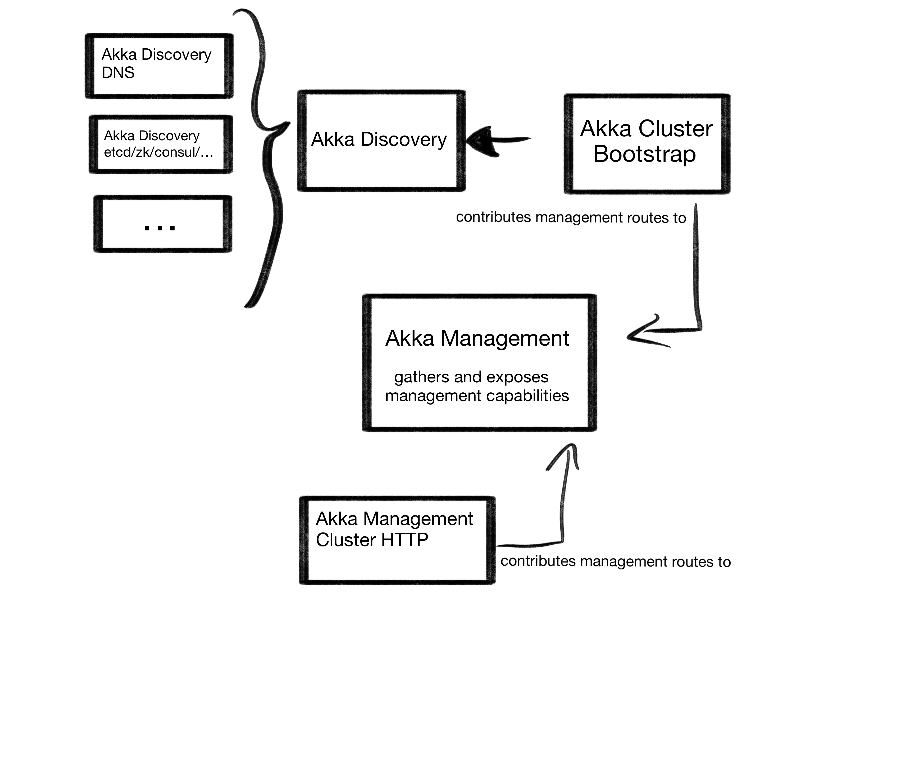

# Akka Management

Akka Management is a suite of tools for operating Akka Clusters.
The current version depends on Akka `2.5.27+`, for older versions of Akka use version `0.20.0`

## Overview

Akka Management consists of multiple modules:

 * @ref[akka-management](akka-management.md) is the base module that provides an extensible HTTP management endpoint for Akka management tools as well a @ref[pluggable health check mechanism](healthchecks.md).
 * @ref[akka-cluster-bootstrap](bootstrap/index.md) helps bootstrapping an Akka cluster using @extref:[Akka Discovery](akka:discovery/index.html).
 * @ref[akka-management-cluster-http](cluster-http-management.md) is a module that provides HTTP endpoints for introspecting and managing Akka clusters.
 * @extref:[Akka's built-in JMX management support](akka:cluster-usage.html#cluster-jmx) provides JMX MBeans for cluster management.
 
 As well as @extref:[Akka Discovery](akka:discovery/index.html) methods for:
 
 * @ref[Kubernetes API](discovery/kubernetes.md)
 * @ref[Consul](discovery/consul.md)
 * @ref[Marathon API](discovery/marathon.md)
 * @ref[AWS](discovery/aws.md)

You don't have to use all the modules but if you do here's how these modules work together:

@@@ index

  - [Akka Management](akka-management.md)
  - [Migrating from older versions](migration.md)
  - [Health Checks](healthchecks.md)
  - [Akka Cluster Bootstrap](bootstrap/index.md)
  - [Akka Discovery Methods](discovery/index.md)
  - [Akka Cluster Management (HTTP)](cluster-http-management.md)
  - [Akka Cluster Management (JMX)](cluster-jmx-management.md)
  - [Dynamic Log Levels](loglevels.md)
@@@
