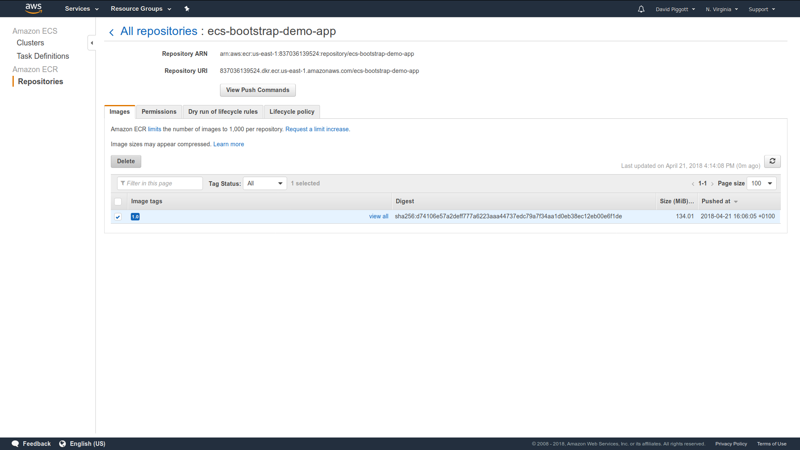

# Your Akka Cluster on ECS

**Note:**

The ECS Service Discovery module and this demo are both written solely
for use with awsvpc mode networking. Use with bridge mode or host mode
networking is _not_ supported.

**Note:**

The provided CloudFormation application stack configures the task definition
and service for use with [Fargate](https://aws.amazon.com/fargate/). This is
done in the interest of simplicity (it removes the need for the stack to also
create a container instance). At the time of writing, Fargate is only available
in the us-east-1 region. This is why the CloudFormation stacks and scripts have
the region set to us-east-1.

However, the ECS Service Discovery is _not_ limited to use with Fargate. By
removing the two Fargate configuration lines and adding a container-instance
resource you can also run it with "classic" bring-your-own-container-instance
ECS (and thus in any region).

**Note:**

You will need to have [SBT](https://www.scala-sbt.org/),
[Docker](https://www.docker.com), and the [AWS CLI](https://aws.amazon.com/cli/)
installed and configured.


# Step 1: Examine the source code

Examine the source code; you'll notice the lack of need for manual
configuration of IPs or host names for the cluster to form - the discovery
mechanisms will do this for us.


# Step 2: Create the ECR repository

You can do this manually via the web console by creating an ECR repository
called `integration-test-aws-api-ecs`, _or_ by running the included
CloudFormation wrapper script:

`./scripts/deploy-infrastucture.sh create`


# Step 3: Build and publish the Docker image

You can do so by running the provided script. We suggest you read the script
before executing it, to understand what's happening inside:

`./scripts/publish.sh`

The script uses `docker:publishLocal` and then tags and pushes the image
manually (in favour of just using `docker:publish` as might normally be done)
because this avoids the need to set `dockerRepository` within the SBT build
(which would then require that we inject the AWS account ID into the build).


# Step 4: Create and validate the cluster

## Create the cluster

Again, the included wrapper script can be used for this (ultimately it
just delegates to `aws cloudformation create-stack`):

`./scripts/deploy.sh create`

## Create the cluster with multiple containers in `TaskDefinition` (Optional)

In case the `TaskDefinition` has multiple `ContainerDefinitions` along with `Akka` 
application (e.g., sidecar), the `ECSServiceDiscovery` can't narrow it down to container 
running `Akka` application. In this scenario the container name needs to passed 
to service discovery:

```-Dakka.discovery.aws-api-ecs-async.container-name=ecs-integration-test-app```

`./scripts/deploy-multiple-containers.sh create`

## Watch it form

The security group that the stack defines and associates with the task
definition includes a rule to allow public access to port 8558 so that the
formation of the cluster can be observed as follows:

`watch -n 1 -c "curl http://$TASK_INSTANCE_IP:8558/cluster/members/ | python
-mjson.tool"`

`$taskInstanceIp` should be replaced with the public IP of any of the five task
instances. You can find these by going to the Elastic Container Service area
of the AWS Management Console, opening the default cluster, selecting the Tasks
tab, and then clicking any one of the five tasks. You can compare with the
screenshot below as a guide to what you're looking for.


When the cluster has fully formed you should see output like this:

```
{
    "leader": "akka.tcp://ecsBootstrapDemoApp@172.31.0.248:2552",
    "members": [
        {
            "node": "akka.tcp://ecsBootstrapDemoApp@172.31.0.248:2552",
            "nodeUid": "-801839214",
            "roles": [
                "dc-default"
            ],
            "status": "Up"
        },
        {
            "node": "akka.tcp://ecsBootstrapDemoApp@172.31.92.234:2552",
            "nodeUid": "-1965866076",
            "roles": [
                "dc-default"
            ],
            "status": "Up"
        },
        {
            "node": "akka.tcp://ecsBootstrapDemoApp@172.31.41.181:2552",
            "nodeUid": "1441500118",
            "roles": [
                "dc-default"
            ],
            "status": "Up"
        },
        {
            "node": "akka.tcp://ecsBootstrapDemoApp@172.31.58.83:2552",
            "nodeUid": "443867006",
            "roles": [
                "dc-default"
            ],
            "status": "Up"
        },
        {
            "node": "akka.tcp://ecsBootstrapDemoApp@172.31.67.222:2552",
            "nodeUid": "-17061216",
            "roles": [
                "dc-default"
            ],
            "status": "Up"
        }
    ],
    "oldest": "akka.tcp://ecsBootstrapDemoApp@172.31.0.248:2552",
    "selfNode": "akka.tcp://ecsBootstrapDemoApp@172.31.58.83:2552",
    "unreachable": []
}
```

Nicely done!

You can also observe the log output from akka-cluster-bootstrap and
akka-cluster by navigating to the CloudWatch area of the AWS Management
Console, opening the Logs tab, and selecting the demo Log Group:


Click any of the five log streams to view the logs of the associated task
instance:


# Step 5: Cleanup

With one exception, deletion of all the resources created by the demo can be
achieved by telling CloudFormation to delete the two stacks.

The exception is that CloudFormation will not delete the ECR repository unless
it's empty, so first go and delete the image in ECR:



You can now delete the two stacks:


